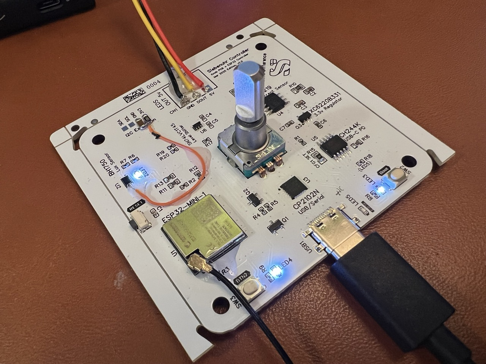
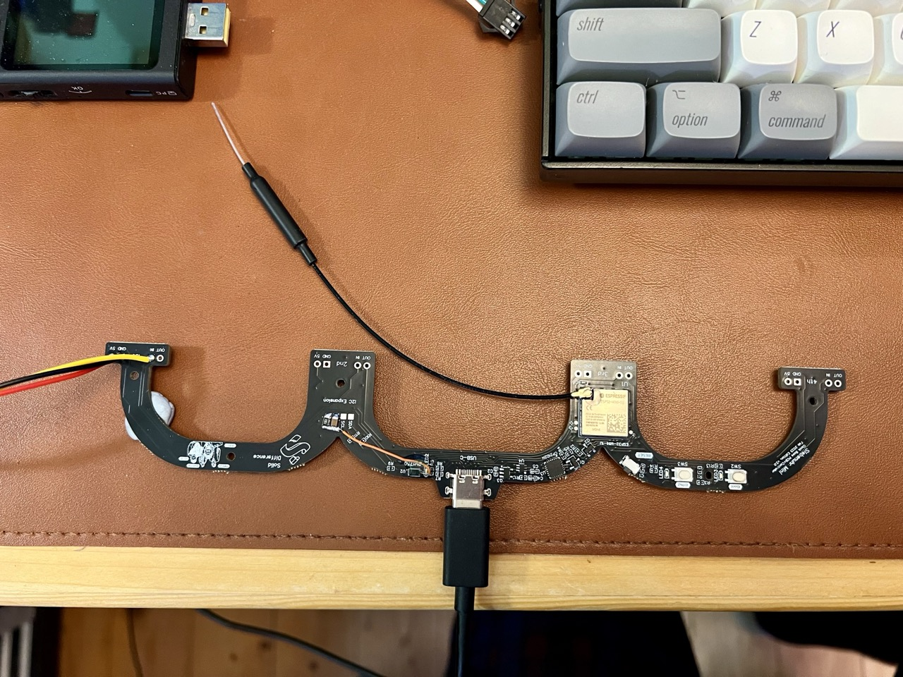
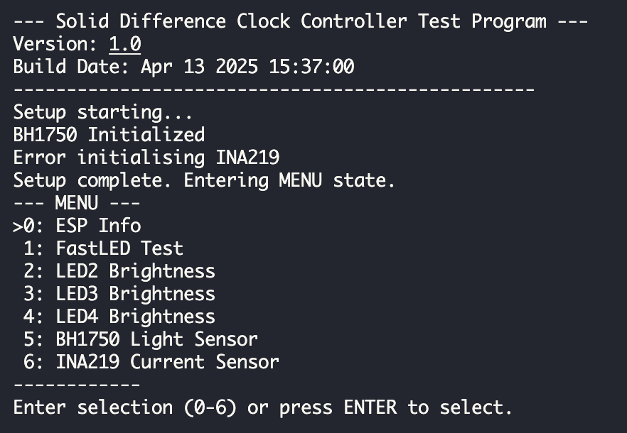
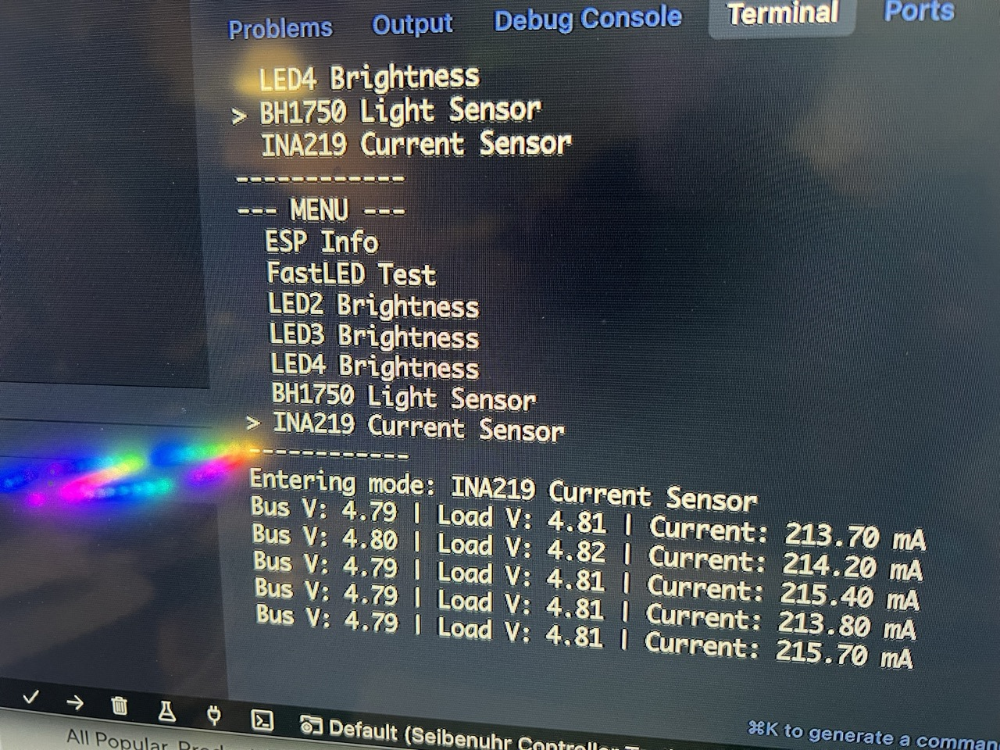

# Siebenuhr Controller Test Program

This program is designed to test the hardware components and basic functionality of the custom controller PCB for the Seibenuhr project. It allows interactive testing of LEDs, sensors, and input controls via the serial monitor and physical buttons/knob.

## Features Tested

* **Inputs:**
  * Rotary Encoder (Rotation and Push Button)
  * User Button (GPIO 33)
  * Boot Button (GPIO 0)
* **Outputs:**
  * FastLED RGB LED Strip (WS2812 type, connected to GPIO 21)
  * PWM LED 2 (GPIO 22)
  * PWM LED 3 (GPIO 19) - *Near Boot Button*
  * PWM LED 4 (GPIO 23) - *Near User Button*
* **Sensors (I2C Bus - SDA: GPIO 14, SCL: GPIO 13):**
  * BH1750 Ambient Light Sensor (Address 0x23)
  * INA219 Current/Voltage Sensor (Address 0x40)
* **Basic ESP32 Info**

## Hardware

## Usage

This app uses PlatformIO, which can also be used inside of Cursor or other VSCode-compatible environments. 

1. **Build and Upload:** Compile and upload the firmware using PlatformIO.
2. **Open Serial Monitor:** Set the baud rate to 115200.
3. **Startup:** The program will display a startup message with version and build date.
4. **Main Menu:** You will be presented with a numbered menu:

    

5. **Navigation:**
    * **Rotary Encoder:** Turn the knob to move the selection cursor (indicated by `>`). Press the knob button to select the highlighted mode.
    * **Serial Monitor:** Type the number corresponding to the desired mode (e.g., `1`) and press Enter, OR simply press Enter when the desired item is highlighted by the knob cursor.
6. **Action Modes:**
    * **LED/FastLED Modes:**
        * Adjust brightness by turning the encoder knob or typing `+` or `-` in the serial monitor.
        * The LED state (on/off, brightness) persists even when you exit the mode.
    * **Sensor/Info Modes:**
        * ESP Info is displayed once upon entry.
        * BH1750 and INA219 readings are displayed periodically (every 2 seconds).
        * Example INA219 readings: `media/current-sensor-readings.jpeg`
    * **Exiting a Mode:** Press the rotary encoder button *or* press Enter *or* type `b` in the serial monitor to return to the main menu.
7. **Direct Button Toggles:**
    * Pressing the **User Button (GPIO 33)** at any time toggles the on/off state of **LED 4** (nearby).
    * Pressing the **Boot Button (GPIO 0)** at any time toggles the on/off state of **LED 3** (nearby).

*example current sensor readings*

### Note

This app was created with the help of Cursor and Gemini 2.5-pro-exp. 
